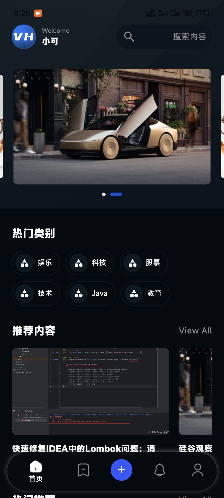
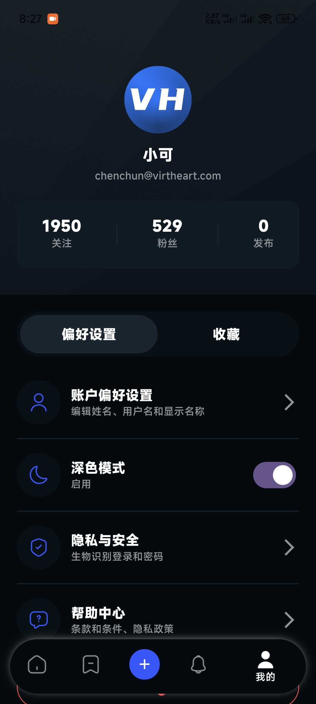

# 新闻应用

一个基于Flutter开发的现代化新闻应用，提供新闻浏览、收藏、通知和用户管理等功能。

## 应用预览

<div style="display: flex; flex-wrap: wrap; gap: 10px;">
  
  
  
  
</div>

## 功能特点

- **新闻浏览**：浏览最新新闻资讯，支持分类查看
- **新闻详情**：查看新闻详细内容
- **用户系统**：支持用户注册、登录和个人信息管理
- **收藏功能**：收藏感兴趣的新闻文章
- **通知中心**：接收应用通知和更新
- **内容发布**：支持用户发布新闻内容
- **个人中心**：管理个人信息和应用设置

## 技术栈

- **框架**：Flutter
- **状态管理**：GetX
- **网络请求**：Dio
- **本地存储**：Hive
- **UI适配**：flutter_screenutil
- **图片加载**：cached_network_image
- **轮播组件**：flutter_swiper_null_safety

## 项目结构

```
lib/
  ├── app/
  │   ├── controllers/     # 控制器
  │   ├── data/            # 数据模型
  │   ├── modules/         # 功能模块
  │   └── routes/          # 路由管理
  ├── components/          # 公共组件
  ├── services/            # 服务
  ├── config.dart          # 配置文件
  └── main.dart            # 应用入口
```

## 安装说明

1. 确保已安装Flutter开发环境
2. 克隆项目到本地
   ```
   git clone [项目地址]
   ```
3. 安装依赖
   ```
   flutter pub get
   ```
4. 运行应用
   ```
   flutter run
   ```

## API接口

应用使用以下API接口：
- 基础URL: `https://sys.virtheart.com/api`
- 详情URL: `https://sys.virtheart.com`

## 开发环境

- Flutter SDK: ^3.5.4
- Dart: 使用Flutter SDK附带版本

## 主要依赖

- cupertino_icons: ^1.0.8
- tdesign_flutter: ^0.1.8
- dio: ^5.8.0+1
- get: ^4.7.2
- hive: ^2.2.3
- flutter_screenutil: ^5.9.3
- cached_network_image: ^3.4.1

## 贡献指南

欢迎提交问题和功能请求，或直接提交代码贡献。